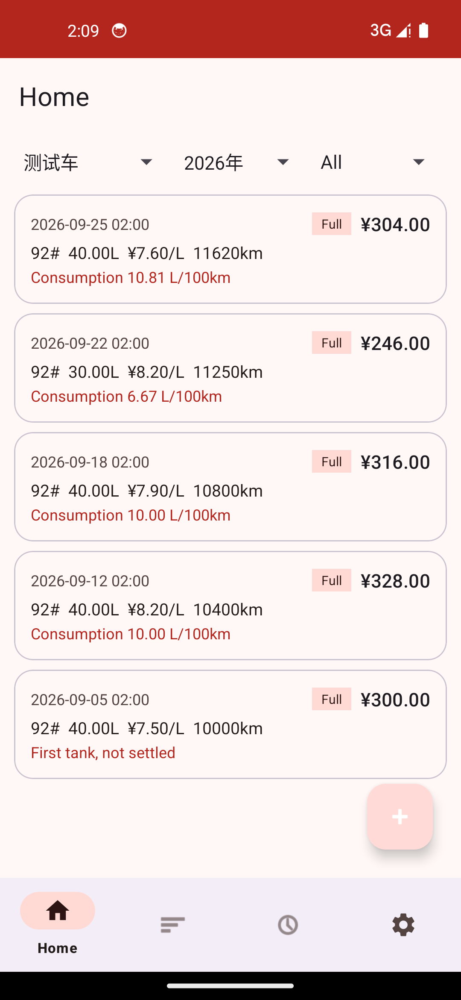
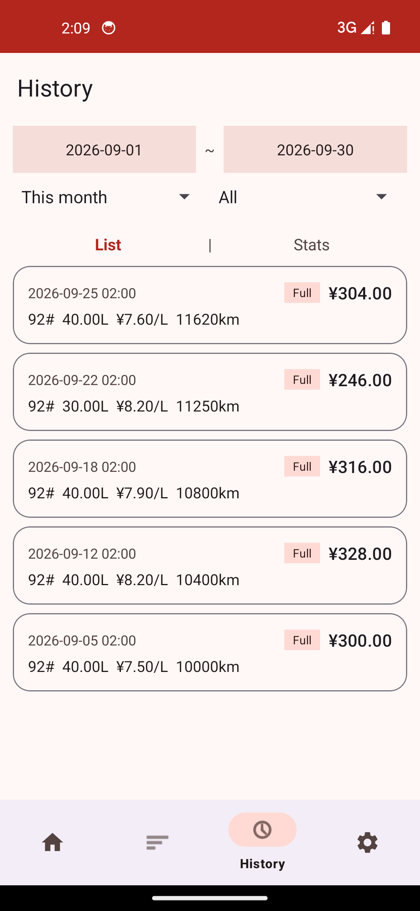
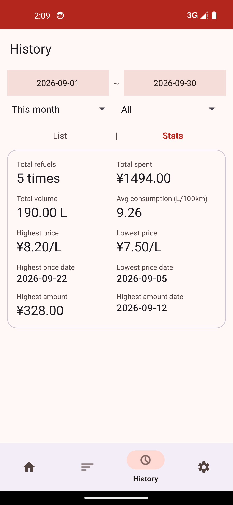
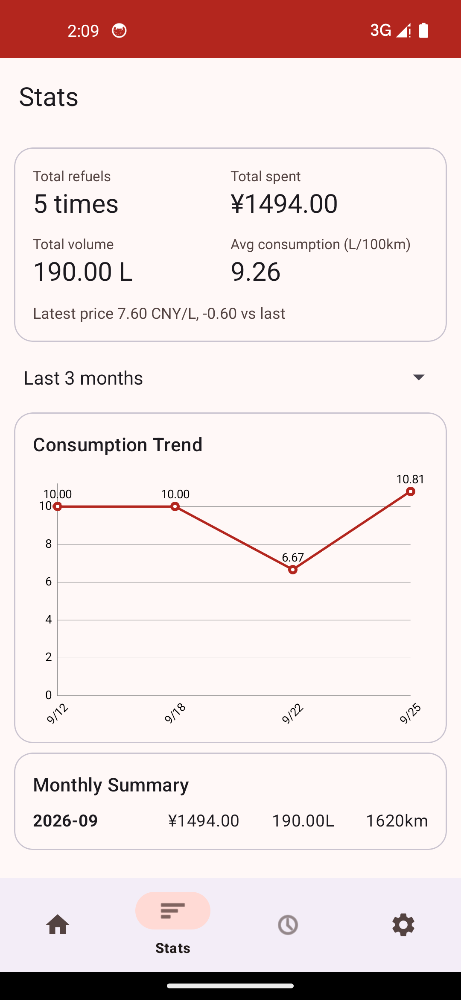
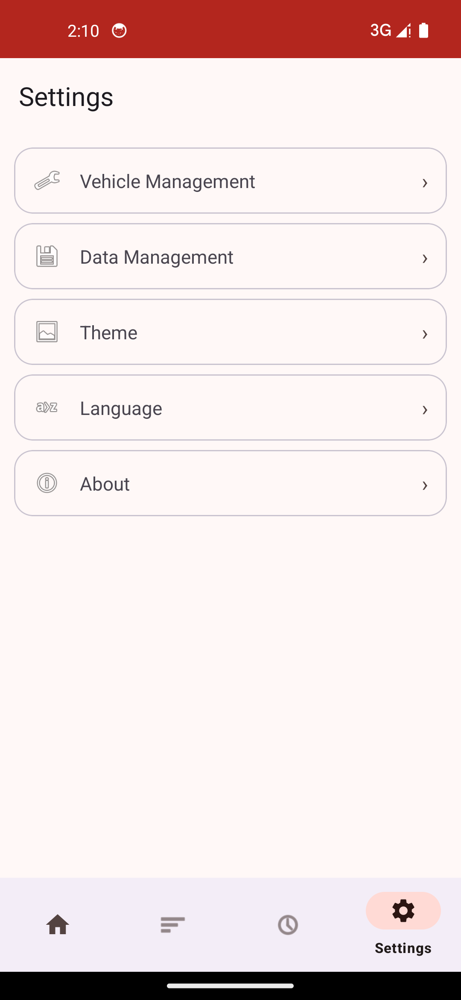

# 加油记账 (carCheer)

一款专注于**油耗记录与分析**的 Android 应用,帮你记录每一次加油,自动计算油耗,用图表看清用车成本。

[English](README_EN.md)

## 功能特性

### 📝 加油记录
- 记录加油日期时间、加油站、油品型号、金额、油量、单价、里程表读数、是否加满
- 基于相邻两次"加满"记录自动结算区间油耗,首箱油自动标注"未结算"
- 支持按车辆、年份、数据类型筛选记录

### 🕘 历史查询
- 时间范围筛选:本月 / 近三月 / 近半年,或自定义起止日期
- 数据类型筛选:全部 / 最高油价 / 最低油价 / 最高加油金额,命中记录高亮并标记"最高/最低"
- 统计卡片:加油次数、总金额、总油量、加权平均油耗、最高/最低油价及发生日期、最高单次金额及日期
- 列表 / 统计两种视图一键切换

### 📊 统计分析
- 概览卡片:总次数、总花费(点击可查看人民币大写)、总油量、加权平均油耗
- 最新油价与上次油价对比(涨跌提示)
- 油耗趋势折线图(本月 / 近三月 / 近半年 / 近一年)
- 按月汇总:每月金额、油量、行驶里程

### ⚙️ 设置
- 多车辆管理,支持默认车辆
- 数据管理:CSV 导出 / 导入(系统文件选择器)、一键清空
- 主题颜色切换、中文 / English 界面语言切换

## 应用截图

| 记录列表 | 历史列表 | 历史统计 |
|---|---|---|
|  |  |  |

| 统计分析 | 设置 |
|---|---|
|  |  |

## 技术架构

- **语言 / 最低版本**:Java,minSdk 24(Android 7.0),targetSdk 34(Android 14)
- **架构模式**:MVVM —— View(Fragment/Activity)→ ViewModel(LiveData)→ Repository → DAO(Room)
- **数据库**:[Room](https://developer.android.com/training/data-storage/room) 2.6.1,导出 Schema 版本文件(`app/schemas/`),支持迁移
- **界面**:[Material Components](https://github.com/material-components/material-components-android) + ViewBinding,单 Activity + 多 Fragment 底部导航
- **图表**:[MPAndroidChart](https://github.com/PhilJay/MPAndroidChart) 油耗趋势折线图
- **文件访问**:Storage Access Framework(SAF)实现 CSV 导出导入,无需存储权限
- **多语言**:AppCompat per-app locales,应用内切换中文 / English
- **单元测试**:统计核心(`StatsCalculator`、`FuelCalculator` 等)为纯 Java 实现,JUnit 覆盖 33 个用例

```
app/src/main/java/com/carcheer/app/
├── data/
│   ├── dao/            # Room DAO(记录、车辆)
│   ├── entity/         # 实体:RefuelRecord、Vehicle
│   └── AppDatabase.java
├── ui/
│   ├── history/        # 历史查询(列表/统计切换)
│   ├── mine/           # 设置、车辆管理、数据管理
│   ├── record/         # 记录列表、新增/编辑页
│   ├── stats/          # 统计分析(概览/趋势图/月度)
│   └── vehicle/        # 车辆增删改
├── util/               # 纯 Java 计算器(油耗、统计、区间、人民币大写、CSV)
├── viewmodel/          # ViewModel(LiveData)
└── ui/MainActivity.java
```

## 构建运行

环境要求:JDK 17、Android Gradle Plugin 8.2.2(Gradle 8.2+)、Android SDK 34。

```bash
# 调试构建
./gradlew assembleDebug

# 运行单元测试
./gradlew test

# 正式签名构建:在项目根目录创建 keystore.properties(勿提交):
#   storeFile=...
#   storePassword=...
#   keyAlias=...
#   keyPassword=...
./gradlew assembleRelease
```

或直接用 Android Studio 打开项目,Sync 后点击运行即可。

## License

本项目基于 [MIT License](LICENSE) 开源发布。
